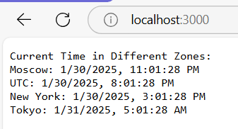

## Overview
This is a simple Node.js web server that displays the current time in several time zones (Moscow, UTC, New York, Tokyo.). The time updates every time the page is refreshed.



## Features
- Displays the current time in 5 time zones.
- Updates the displayed time dynamically upon page refresh.

## **Run with Docker Instructions**

### **1. Build the Docker Image**
```sh
docker build -t sonyaiv/js_app .
```

2. **Run the Docker Container**
```sh
docker run -d -p 3000:3000 sonyaiv/js_app
```
Open your browser and visit: http://localhost:3000