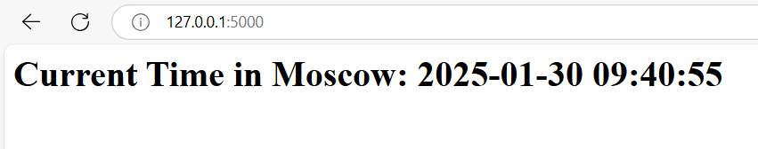

## Overview
This is a simple Python web application that displays the current time in Moscow. It uses the Flask framework and follows best practices. The simple design is done with HTML.



## Features
- Displays the current time in Moscow.
- Updates the displayed time dynamically.
- Simple and lightweight.

## CI Workflow

This project uses **GitHub Actions** for Continuous Integration (CI).

1. **Dependency Installation** - Installs required Python packages.
2. **Code Linting** - Ensures code follows best practices.
3. **Unit Tests** - Runs tests to validate the app.
4. **Docker Build & Push** - Builds and pushes a container image.


## Local Installation

1. **Clone the Repository:**
   ```bash
   git clone https://github.com/sonyivanova/S25-devops-labs.git
   cd app_python
   ```

2. **Install Dependencies:**
   ```bash
   pip install -r requirements.txt
   ```

3. **Run the Application:**
   ```bash
   python app.py
   ```

4. **Access the App:**
   Open your web browser and go to `http://127.0.0.1:5000` or `http://10.80.18.164:5000`.

## Docker Instructions

1. **Build the image**
```sh
docker build -t sonyaiv/python_app .
```

2. **Run the container**
```sh
docker run --rm -p 5000:5000 sonyaiv/python_app
```

3. **Pull from Docker Hub**
```sh
docker pull sonyaiv/python_app
docker run -d -p 5000:5000 sonyaiv/python_app
```

## Unit Tests

**Run Unit Tests**
```bash
python -m unittest test_app.py
```

## Requirements
- Flask
- pytz

## File Structure
```
app_python/
├── app.py
├── PYTHON.md
├── README.md
├── requirements.txt
├── .gitignore
```

## .gitignore
```
__pycache__/
*.pyc
.env
.vscode/
venv/
```

## .dockerignore
```
__pycache__/
*.pyc
*.pyo
*.pyd
.git/
.DS_Store
.env
```