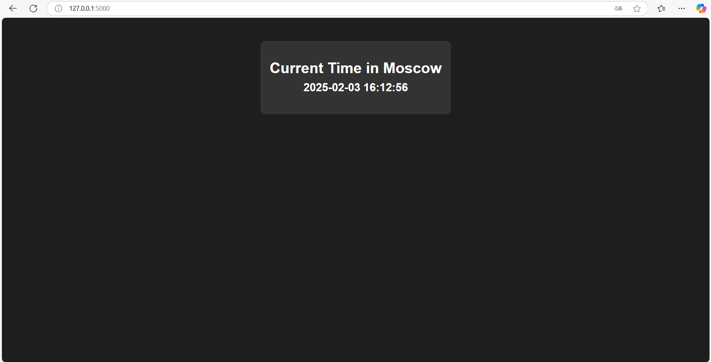

## Overview
This is a simple Python web application that displays the current time in Moscow. It uses the Flask framework and follows best practices. The time updates every time the page is refreshed.



## Features
- Displays the current time in Moscow.
- Updates the displayed time dynamically upon page refresh.
- Simple and lightweight.

## Local Installation

1. **Clone the Repository:**
   ```bash
   git clone https://github.com/sonyivanova/S25-devops-labs.git
   cd app_python
   ```

2. **Install Dependencies:**
   ```bash
   pip install -r requirements.txt
   ```

3. **Run the Application:**
   ```bash
   python app.py
   ```

4. **Access the App:**
   Open your web browser and go to `http://127.0.0.1:5000`.

## Requirements
- Flask
- pytz

## File Structure
```
app_python/
├── app.py
├── PYTHON.md
├── README.md
├── requirements.txt
├── .gitignore
```

## .gitignore
```
__pycache__/
*.pyc
.env
.vscode/
venv/
```