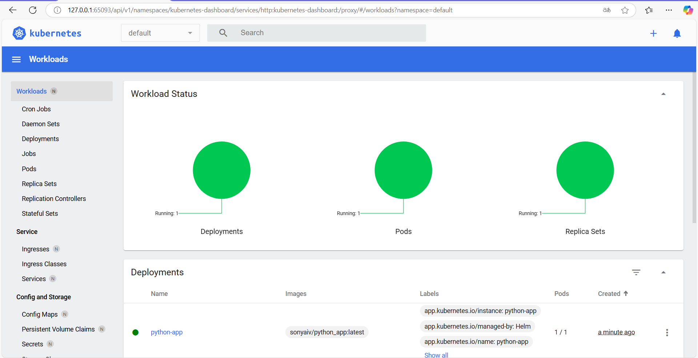

# Helm Setup and Chart Creation

This document provides the results of setup of Helm and the creation of a Helm chart for the Python application.

# Output

## Workloads Page



## `minikube service python-app`

```bash
S25-devops-labs\k8s> minikube service python-app
|-----------|------------|-------------|--------------|
| NAMESPACE |    NAME    | TARGET PORT |     URL      |
|-----------|------------|-------------|--------------|
| default   | python-app |             | No node port |
|-----------|------------|-------------|--------------|
* service default/python-app has no node port
! Services [default/python-app] have type "ClusterIP" not meant to be exposed, however for local development minikube allows you to access this !
* Starting tunnel for service python-app.
|-----------|------------|-------------|------------------------|
| NAMESPACE |    NAME    | TARGET PORT |          URL           |
|-----------|------------|-------------|------------------------|
| default   | python-app |             | http://127.0.0.1:49198 |
|-----------|------------|-------------|------------------------|
* Opening service default/python-app in default browser...
! Because you are using a Docker driver on windows, the terminal needs to be open to run it.
```

## `kubectl get pods,svc`

```bash
S25-devops-labs\k8s> kubectl get pods,svc
NAME                              READY   STATUS    RESTARTS   AGE
pod/python-app-6c449fbfc7-xrm8c   1/1     Running   0          3m17s

NAME                 TYPE        CLUSTER-IP      EXTERNAL-IP   PORT(S)   AGE  
service/kubernetes   ClusterIP   10.96.0.1       <none>        443/TCP   3d23h
service/python-app   ClusterIP   10.109.31.197   <none>        80/TCP    3m17s
```