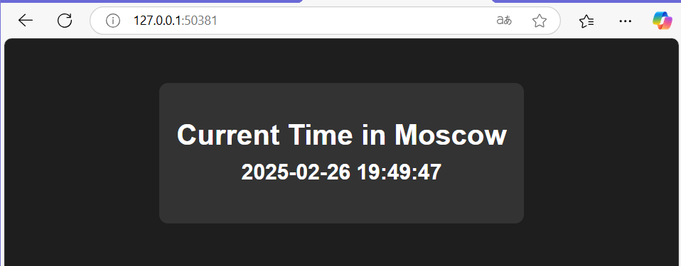

# Kubernetes Deployment

This folder contains Kubernetes manifests for deploying the Python application.


## Task 1 Output

```bash
S25-devops-labs> kubectl get pods,svc
NAME                              READY   STATUS    RESTARTS   AGE
pod/app-python-654ccd46c7-b6z4t   1/1     Running   0          84s

NAME                 TYPE        CLUSTER-IP   EXTERNAL-IP   PORT(S)   AGE
service/kubernetes   ClusterIP   10.96.0.1    <none>        443/TCP   106s
```

## Task 2 Output

```bash
S25-devops-labs> kubectl get pods,svc
NAME                              READY   STATUS    RESTARTS   AGE  
pod/python-app-5b58d7cb96-lgmt5   1/1     Running   0          6m10s
pod/python-app-5b58d7cb96-llfbf   1/1     Running   0          6m10s
pod/python-app-5b58d7cb96-q85vx   1/1     Running   0          6m10s

NAME                         TYPE        CLUSTER-IP     EXTERNAL-IP   PORT(S)          AGE
service/kubernetes           ClusterIP   10.96.0.1      <none>        443/TCP          6m20s
service/python-app-service   NodePort    10.98.126.57   <none>        5000:30101/TCP   6m6s
```

```bash
S25-devops-labs>minikube service \--all
|-----------|------------|-------------|--------------|
| NAMESPACE |    NAME    | TARGET PORT |     URL      |
|-----------|------------|-------------|--------------|
| default   | kubernetes |             | No node port |
|-----------|------------|-------------|--------------|
* service default/kubernetes has no node port
|-----------|--------------------|-------------|---------------------------|
| NAMESPACE |        NAME        | TARGET PORT |            URL            |
|-----------|--------------------|-------------|---------------------------|
| default   | python-app-service |        5000 | http://192.168.49.2:30101 |
|-----------|--------------------|-------------|---------------------------|
! Services [default/kubernetes] have type "ClusterIP" not meant to be exposed, however for local development minikube allows you to access this !
* Starting tunnel for service kubernetes.
* Starting tunnel for service python-app-service.
|-----------|--------------------|-------------|------------------------|
| NAMESPACE |        NAME        | TARGET PORT |          URL           |
|-----------|--------------------|-------------|------------------------|
| default   | kubernetes         |             | http://127.0.0.1:50379 |
| default   | python-app-service |             | http://127.0.0.1:50381 |
|-----------|--------------------|-------------|------------------------|
* Opening service default/kubernetes in default browser...
* Opening service default/python-app-service in default browser...
! Because you are using a Docker driver on windows, the terminal needs to be open to run it.
```

