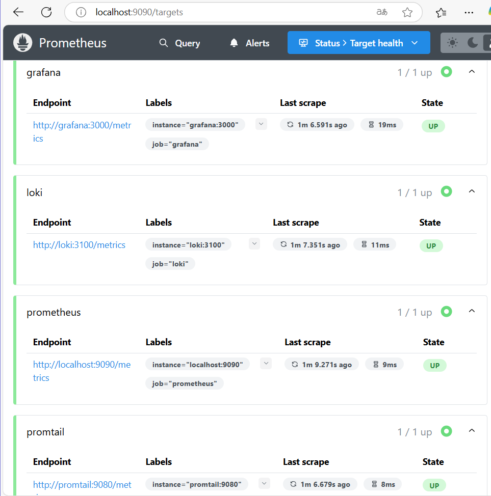
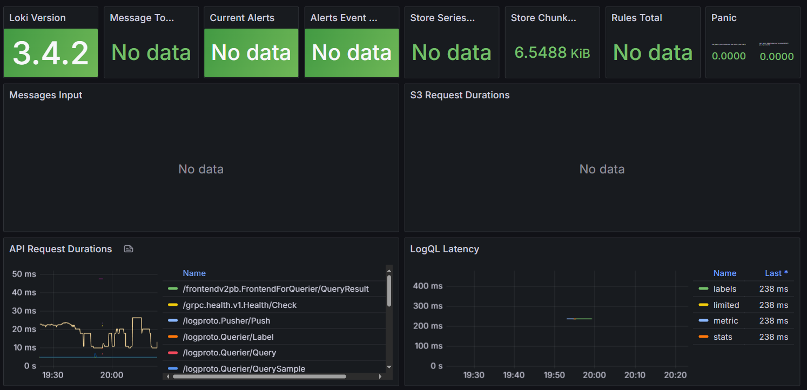
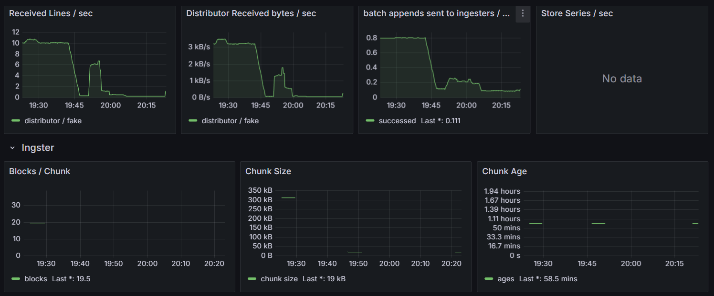
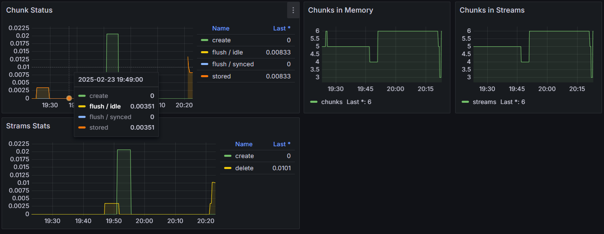
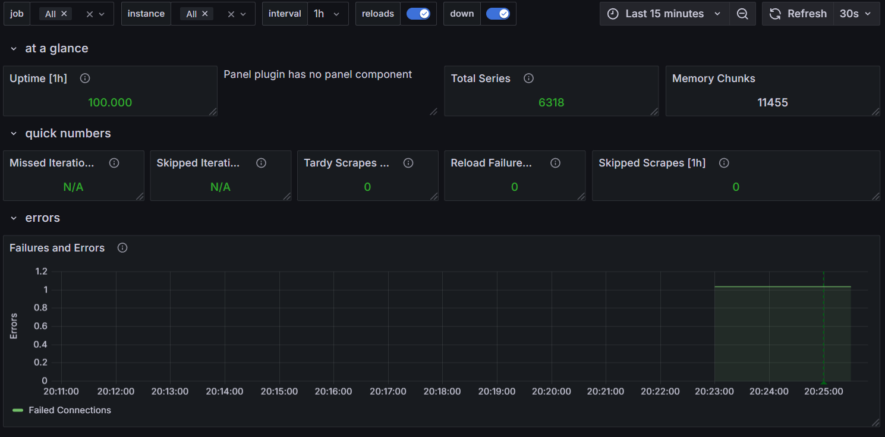
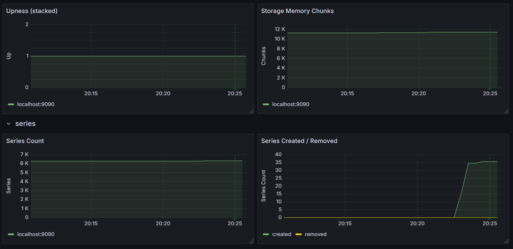
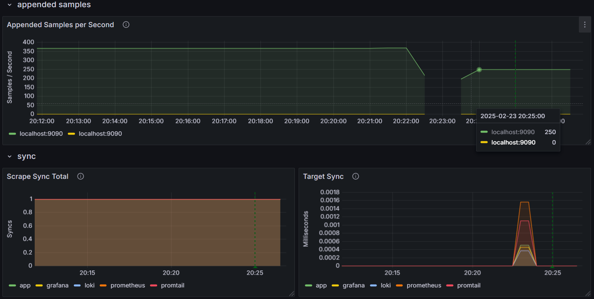
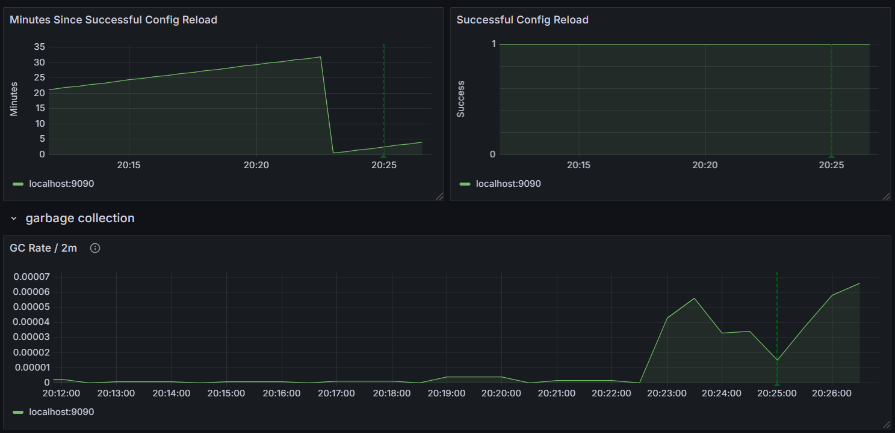

# Metrics Monitoring Setup

This document describes the setup of Prometheus, Grafana, and Loki for metrics and log monitoring.

## Prometheus Setup

- **Prometheus UI**: Accessible at `http://localhost:9090`.
- **Targets**: Verified at `http://localhost:9090/targets`.
- **Screenshot**:
  

## Grafana Dashboards

- **Loki Dashboard**: Imported from [Grafana Dashboard 13407](https://grafana.com/grafana/dashboards/13407).

  
  
  

- **Prometheus Dashboard**: Imported from [Grafana Dashboard 3662](https://grafana.com/grafana/dashboards/3662).

  
  
  
  
  
## Service Configuration Enhancements

- **Log Rotation**: Configured for all services using `json-file` driver with `max-size: 10m` and `max-file: 3`.
- **Memory Limits**: Applied to all containers (e.g., `mem_limit: 512m`).
- **Healthcheck**: Added to all services to ensure they are running correctly.

## Metrics Gathering

- Prometheus is configured to scrape metrics from:
  - Prometheus (`localhost:9090`)
  - Loki (`loki:3100`)
  - Promtail (`promtail:9080`)
  - Grafana (`grafana:3000`)
  - Application (`app:5000`)
